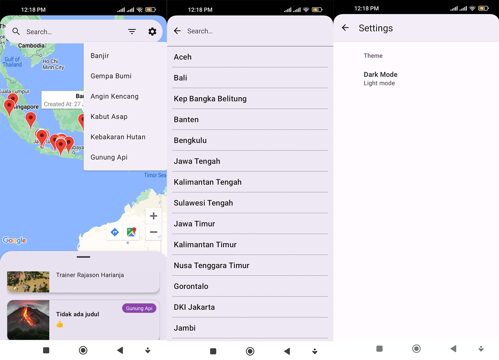
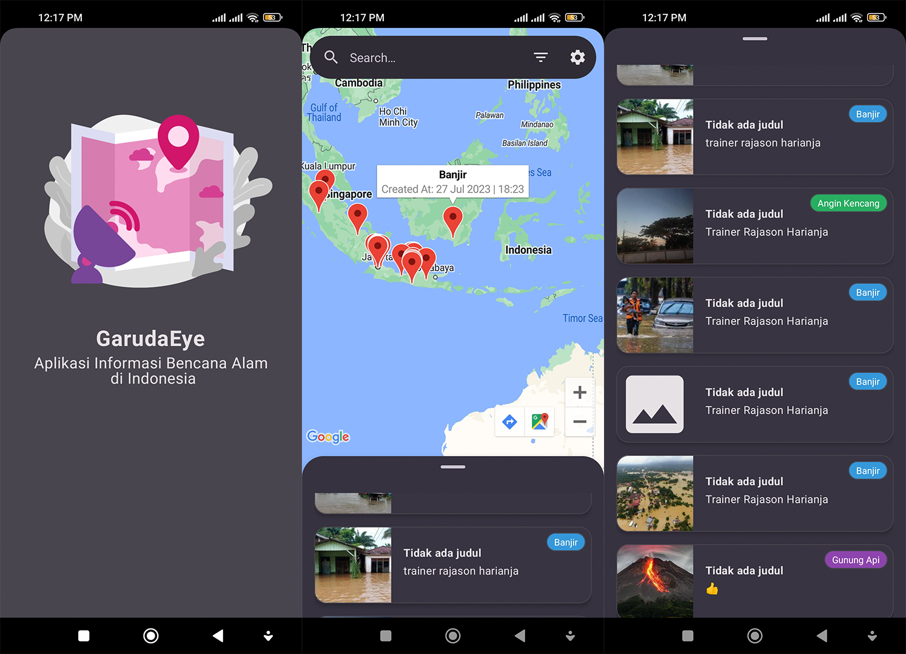
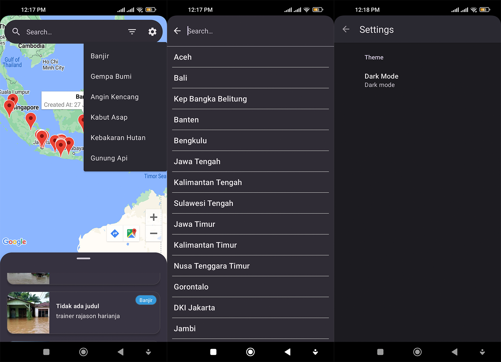

# GarudaEye - Disaster Information App in Indonesia

## Introduction
GarudaEye App is an application that provides real-time information about disasters in Indonesia. The data used in the application is obtained from the [PetaBencana API](https://docs.petabencana.id/routes/). This application is developed using the Kotlin programming language and designed with XML.

### The Motivation behind the app
The motivation behind this app is to fulfill the final project requirement for the program I participated in, which is GIGIH 3.0 organized by GoTo Impact Foundation.

## Features
GarudaEye App provides various features that help users to get up-to-date information about disasters in Indonesia. Here are some of the available features:
1. **List of Disasters in Indonesia**: Displays a list of disasters that occurred in Indonesia within the last 2 days.
2. **Natural Disaster Filters**: Users can filter disasters based on the following types:
   - Flood
   - Earthquake
   - Strong Wind
   - Haze
   - Forest Fire
   - Volcanic Eruption
3. **Filter by Province**: Users can filter disasters based on the provinces in Indonesia.
4. **Map View**: The application displays a map showing the locations of disasters in Indonesia.
5. **Water Level Warning Notifications**: Users will receive warning notifications if the water level in a dam rises. (For now, the data for this feature is still dummy as it is empty from the API endpoint /floodgauges to get water level data in a specific region).
6. **Dark Mode Theme**: The app supports a dark mode theme for user comfort during nighttime use.
7. **Disaster Details (Coming Soon)**: Users will be able to view detailed information about disasters in the next release.

## Built With 🛠
- [Android Architecture Components](https://developer.android.com/topic/libraries/architecture) - Collection of libraries that help you design robust, testable, and maintainable apps.
- [Android KTX](https://developer.android.com/kotlin/ktx) - A set of Kotlin extensions that makes Android development with Kotlin more concise, idiomatic, and pleasant.
- [AndroidX AppCompat](https://developer.android.com/jetpack/androidx/releases/appcompat) - A support library that provides backward compatibility for newer Android features on older versions of the platform.
- [AndroidX Legacy Support](https://developer.android.com/jetpack/androidx/releases/legacy) - A set of libraries that provide support for older Android versions and features.
- [AndroidX Preference](https://developer.android.com/jetpack/androidx/releases/preference?hl=id) - A support library that allows you to manage application preferences using a convenient and modern API.
- [Constraint Layout](https://developer.android.com/training/constraint-layout) - A layout manager for Android that allows you to create complex layouts with flat view hierarchies.
- [Glide](https://github.com/bumptech/glide) - An image loading and caching library for Android that makes it easy to load images from various sources efficiently.
- [Google Play Services Maps](https://developers.google.com/maps/documentation/android-sdk/overview) - Allows you to integrate Google Maps into your Android app for location-based services and mapping functionalities.
- [Gson Converter](https://github.com/square/retrofit/tree/master/retrofit-converters/gson) - A Retrofit converter that converts JSON responses to Java objects using the Gson library.
- [Kotlin](https://kotlinlang.org/) - First class and official programming language for Android development.
- [Lottie](https://airbnb.io/lottie/#/) - A library for Android, iOS, and the web that parses Adobe After Effects animations exported as JSON and renders them natively on mobile and web platforms.
- [LiveData](https://developer.android.com/topic/libraries/architecture/livedata) - Data objects that notify views when the underlying database changes.
- [Material Components](https://material.io/develop/android) - A collection of Android components that follow the Material Design guidelines to create modern and consistent user interfaces.
- [OkHttp Logging Interceptor](https://square.github.io/okhttp/interceptors) - An OkHttp interceptor that logs HTTP request and response data for debugging purposes.
- [Retrofit](https://square.github.io/retrofit/) - A type-safe HTTP client for Android and Java that simplifies communication with web services and APIs.
- [ViewBinding](https://developer.android.com/topic/libraries/view-binding) - Generates a binding class for each XML layout file present in that module and allows you to more easily write code that interacts with views.
- [ViewModel](https://developer.android.com/topic/libraries/architecture/viewmodel) - Stores UI-related data that isn't destroyed on UI changes.
- [WorkManager](https://developer.android.com/topic/libraries/architecture/workmanager) - Schedule deferrable, asynchronous tasks.

## Installation
To use this application, follow the steps below:
1. Ensure that your Android device has a minimum API level of 24.
2. Clone this repository to your device using the following command:
```bash
git clone https://github.com/GG-3-0-Mobile-Engineering/ME14-JosuaManalu-GG3MEGP0563-GarudaEye.git
```
3. Open the project in Android Studio.
4. Make sure you have a Google Maps API key to display the map in the application
(You need to obtain the API key from [here](https://developers.google.com/maps/documentation/android-sdk/get-api-key)).
5. After that, you can search for the local.properties file and insert your Google Maps API key into it as follows:
```bash
MAPS_API_KEY=PutYourAPIKeyHere
```
6. Finally, build and run the application.

## App Screenshots
Here are some screenshots of the application that showcase various features available in GarudaEye.
| Mode  | Feed                                                                                   | 
|-------|----------------------------------------------------------------------------------------|
| <b>Light</b> | <br><br> |
| <b>Dark</b>  | <br><br>  |

## Download GarudaEye App
The application can be downloaded at the following link:
<a href="https://drive.google.com/file/d/1WwJognsJKK92IZxyC1qlHE3oQT-Z9ndS/view?usp=sharing">Click here.</a>

## Contribution
If you wish to contribute to this project, you can submit a Pull Request to this repository. I highly appreciate contributions from users.

## Contact
If you have any questions or suggestions regarding this application, you can reach out to me via email at josuamnalu@gmail.com.

*By using the GarudaEye application, you can quickly and accurately obtain disaster information, helping you to take appropriate actions in emergency situations. Hopefully, this application can assist the Indonesian community in staying vigilant against potential disasters.*
