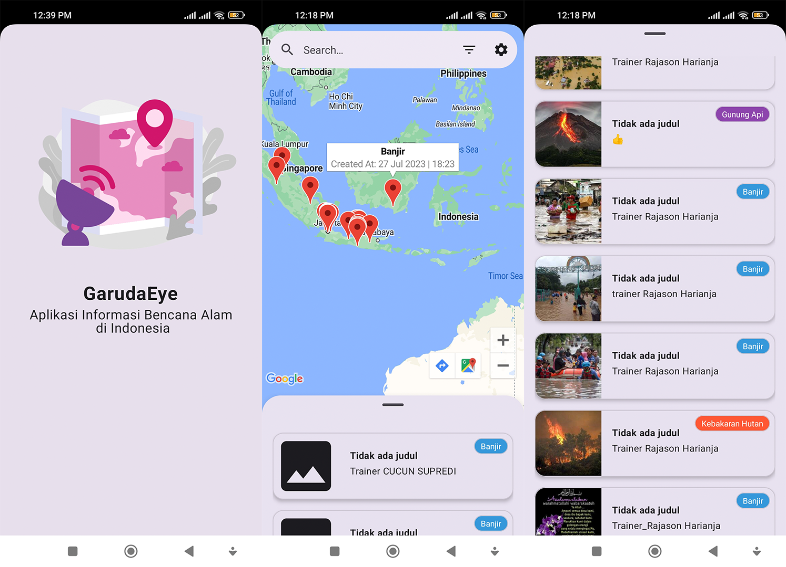

# GarudaEye - Aplikasi Informasi Bencana Alam di Indonesia

## Introduction

Aplikasi GarudaEye adalah sebuah aplikasi yang memberikan informasi tentang bencana di Indonesia secara realtime. Data yang digunakan diambil dari API [PetaBencana](https://docs.petabencana.id/routes/). Aplikasi ini dikembangkan menggunakan bahasa pemrograman Kotlin dan di desain dengan XML.

## Fitur

Aplikasi GarudaEye menyediakan berbagai fitur yang membantu pengguna untuk mendapatkan informasi terkini mengenai bencana di Indonesia. Berikut adalah beberapa fitur yang tersedia:

1. **Daftar Bencana di Indonesia**: Menampilkan daftar bencana yang terjadi di Indonesia dalam periode waktu 2 hari terakhir.

2. **Filter Bencana Alam**: Pengguna dapat memfilter jenis bencana alam seperti:
   - Banjir
   - Gempabumi
   - Angin Kencang
   - Kabut Asap
   - Kebakaran Hutan
   - Gunung Api

3. **Filter Berdasarkan Provinsi**: Pengguna dapat memfilter bencana berdasarkan provinsi yang ada di Indonesia.

4. **Tampilan Peta**: Aplikasi menampilkan peta yang menunjukkan lokasi bencana di Indonesia.

5. **Notifikasi Peringatan Level Air Bendungan**: Pengguna akan menerima notifikasi peringatan jika level air di bendungan naik. (Untuk sementara data dari fitur ini sifatnya masih dummy karena datanya kosong dari API endpoint /floodgauges(untuk mendapatkan level ketinggian air di suatu wilayah).

6. **Tema Dark Mode**: Aplikasi mendukung tema dark mode untuk kenyamanan pengguna dalam menggunakannya pada malam hari.

7. **Detail Bencana (Segera Hadir)**: Pengguna akan dapat melihat detail informasi tentang bencana secara lengkap dalam rilis berikutnya.

## Instalasi

Untuk menggunakan aplikasi ini, ikuti langkah-langkah di bawah ini:

1. Clone repository ini ke dalam perangkat Anda dengan perintah berikut:

```bash
git clone https://github.com/username/nama-repo.git
```

2. Buka project di Android Studio.
3. Lakukan build dan jalankan aplikasi. Pastikan Anda memiliki kunci API dari Google Maps untuk menampilkan peta pada aplikasi.

## Tampilan Aplikasi
Berikut adalah beberapa tangkapan layar aplikasi yang menunjukkan berbagai fitur yang tersedia dalam GarudaEye.
1. Light Mode



2. Dark Mode


Aplikasi bisa di download di link berikut ini:
https://drive.google.com/file/d/1WwJognsJKK92IZxyC1qlHE3oQT-Z9ndS/view?usp=sharing

## Kontribusi
Jika Anda ingin berkontribusi pada proyek ini, Anda dapat mengirimkan Pull Request ke repository ini. Kami sangat menghargai kontribusi dari para pengguna.

## Kontak
Jika Anda memiliki pertanyaan atau saran terkait aplikasi ini, Anda dapat menghubungi tim GarudaEye melalui email josuamnalu@gmail.com.

## Lisensi
Aplikasi GarudaEye dirilis di bawah lisensi MIT. Untuk informasi lebih lanjut tentang lisensi, silakan lihat LICENSE.

*Dengan menggunakan aplikasi GarudaEye, Anda dapat mendapatkan informasi bencana secara cepat dan akurat, membantu Anda untuk mengambil tindakan yang tepat dalam menghadapi situasi darurat. Semoga aplikasi ini dapat membantu masyarakat Indonesia untuk selalu waspada terhadap potensi bencana.*
