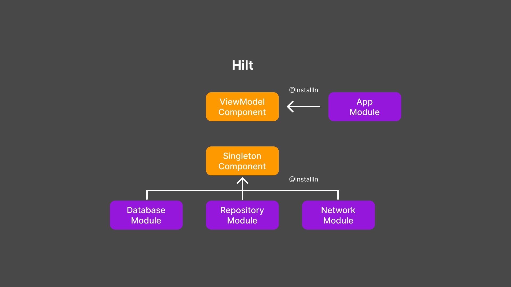

# GarudaEye - Disaster Information App in Indonesia

## Introduction
GarudaEye App is an application that provides real-time information about disasters in Indonesia. The data used in the application is obtained from the [PetaBencana API](https://docs.petabencana.id/routes/). This application is developed using the Kotlin programming language and designed with XML.

### The Motivation behind the app
The motivation behind this app is to fulfill the final project requirement for the program I participated in, which is GIGIH 3.0 organized by GoTo Impact Foundation.

## Features
GarudaEye App provides various features that help users to get up-to-date information about disasters in Indonesia. Here are some of the available features:
1. **List of Disasters in Indonesia**: Displays a list of disasters that occurred in Indonesia within the last 2 days.
2. **Natural Disaster Filters**: Users can filter disasters based on the following types:
   - Flood
   - Earthquake
   - Strong Wind
   - Haze
   - Forest Fire
   - Volcanic Eruption
3. **Filter by Province**: Users can filter disasters based on the provinces in Indonesia.
4. **Map View**: The application displays a map showing the locations of disasters in Indonesia.
5. **Water Level Warning Notifications**: Users will receive warning notifications if the water level in a dam rises. (For now, the data for this feature is still dummy as it is empty from the API endpoint /floodgauges to get water level data in a specific region).
6. **Dark Mode Theme**: The app supports a dark mode theme for user comfort during nighttime use.
7. **Disaster Details**: Users will be able to view detailed information about disasters in the next release.
8. **Offline-First Approach**: Recognizing that connectivity might be compromised during disasters, I've implemented an offline-first approach. The app is designed to function seamlessly even when network access is limited or unavailable. It caches essential data locally, ensuring that you can access crucial information when you need it the most.

## Built With 🛠
| Name | Version |
| ---- | ------- |
| [Kotlin](https://kotlinlang.org/) | 1.8.0 |
| [Core-KTX](https://developer.android.com/jetpack/androidx/releases/core) | 1.10.1 |
| [AppCompat](https://developer.android.com/jetpack/androidx/releases/appcompat) | 1.6.1 |
| [Material Design](https://material.io/develop/android/docs/getting-started/) | 1.9.0 |
| [ConstraintLayout](https://developer.android.com/jetpack/androidx/releases/constraintlayout) | 2.1.4 |
| [Glide](https://bumptech.github.io/glide/) | 4.15.1 |
| [Retrofit 2](https://square.github.io/retrofit/) | 2.9.0 |
| [Gson Converter](https://square.github.io/retrofit/) | 2.9.0 |
| [OkHttp 3](https://square.github.io/okhttp/) | 4.9.3 |
| [Google Maps SDK for Android](https://developers.google.com/maps/documentation/android-sdk) | 18.1.0 |
| [Legacy Support Library](https://developer.android.com/jetpack/androidx/releases/legacy) | 1.0.0 |
| [RecyclerView](https://developer.android.com/jetpack/androidx/releases/recyclerview) | 1.3.0 |
| [Preferences](https://developer.android.com/jetpack/androidx/releases/preference) | 1.2.0 |
| [AndroidX Test Core-KTX](https://developer.android.com/jetpack/androidx/releases/test) | 1.5.0 |
| [JUnit](https://junit.org/junit4/) | 4.13.2 |
| [AndroidX Test JUnit-KTX](https://developer.android.com/jetpack/androidx/releases/test) | 1.1.5 |
| [AndroidX Test Runner](https://developer.android.com/jetpack/androidx/releases/test) | 1.5.0 |
| [AndroidX Test Rules](https://developer.android.com/jetpack/androidx/releases/test) | 1.5.0 |
| [Espresso Intents](https://developer.android.com/jetpack/androidx/releases/test) | 3.5.1 |
| [Espresso Core](https://developer.android.com/jetpack/androidx/releases/test) | 3.5.1 |
| [Mockito Core](https://site.mockito.org/) | 4.4.0 |
| [Mockito Inline](https://site.mockito.org/) | 4.4.0 |
| [MockK](https://mockk.io/) | 1.12.0 |
| [Kotlinx Coroutines Test](https://kotlinlang.org/api/kotlinx.coroutines/kotlinx-coroutines-test/) | 1.7.3 |
| [AndroidX Arch Core](https://developer.android.com/jetpack/androidx/releases/arch-core) | 2.2.0 |
| [Lottie Animation](https://github.com/airbnb/lottie-android) | 6.1.0 |
| [AndroidX Work Runtime](https://developer.android.com/jetpack/androidx/releases/work) | 2.8.1 |
| [Room Runtime](https://developer.android.com/jetpack/androidx/releases/room) | 2.5.2 |
| [Room Compiler](https://developer.android.com/jetpack/androidx/releases/room) | 2.5.2 |
| [Room Testing](https://developer.android.com/jetpack/androidx/releases/room) | 2.5.2 |
| [Room KTX](https://developer.android.com/jetpack/androidx/releases/room) | 2.5.2 |
| [Hilt Android](https://developer.android.com/training/dependency-injection/hilt-android) | 2.47 |
| [Hilt Android Compiler](https://developer.android.com/training/dependency-injection/hilt-android) | 2.47 |
| [Kotlinx Coroutines Core](https://github.com/Kotlin/kotlinx.coroutines) | 1.7.3 |
| [Kotlinx Coroutines Android](https://github.com/Kotlin/kotlinx.coroutines) | 1.7.3 |
| [Lifecycle LiveData KTX](https://developer.android.com/jetpack/androidx/releases/lifecycle) | 2.6.1 |
| [Activity KTX](https://developer.android.com/jetpack/androidx/releases/activity) | 1.7.2 |

## Installation
To use this application, follow the steps below:
1. Ensure that your Android device has a minimum API level of 24.
2. Clone this repository to your device using the following command:
```bash
git clone https://github.com/GG-3-0-Mobile-Engineering/ME14-JosuaManalu-GG3MEGP0563-GarudaEye.git
```
3. Open the project in Android Studio.
4. Make sure you have a Google Maps API key to display the map in the application
(You need to obtain the API key from [here](https://developers.google.com/maps/documentation/android-sdk/get-api-key)).
5. After that, you can search for the local.properties file and insert your Google Maps API key into it as follows:
```bash
MAPS_API_KEY=PutYourAPIKeyHere
```
6. Finally, build and run the application.

## App Screenshots
Here are some screenshots of the application that showcase various features available in GarudaEye.
| Mode  | Feed                                                                                   | 
|-------|----------------------------------------------------------------------------------------|
| <b>Light</b> | <br><br> |
| <b>Dark</b>  | <br><br>  |

## Architecture
Our app is built using the principles of Clean Architecture with the MVVM (Model-View-ViewModel) design pattern. This architecture promotes separation of concerns, maintainability, and testability. The app is divided into three main layers:


- ### Presentation Layer (UI)
This layer consists of activities, fragments, and views. It interacts with the ViewModel to display data and responds to user actions. We use Android's [ViewModel](https://developer.android.com/topic/libraries/architecture/viewmodel) to manage UI-related data and state.

- ### Domain Layer (Use Cases)
The domain layer contains the business logic and use cases of the application. It's independent of any framework or platform-specific implementations. This layer defines the core functionalities and operations of the app.

- ### Data Layer (Repositories and Data Sources)
The data layer is responsible for fetching and storing data. It contains repositories that act as the single source of truth for data. Data can be fetched from various sources, such as local databases or remote APIs.

## Dependency Injection: Hilt
We utilize [Hilt](https://dagger.dev/hilt/) for dependency injection. Hilt is a framework built on top of Dagger 2 that simplifies dependency injection in Android apps. It offers a more concise and declarative way to provide and inject dependencies.

### Benefits of Hilt
- **Simplified Setup:** Hilt reduces the boilerplate code required for Dagger 2 setup, making dependency injection configuration cleaner and more maintainable.
- **Scoped Injection:** Hilt supports scoping dependencies to different levels, ensuring that each component gets the appropriate instances of objects.
- **Compile-Time Checks:** Hilt performs most of its dependency injection setup at compile time, providing early detection of issues and reducing runtime errors.

### Integration of Hilt


1. **Application Component:** We annotate our custom Application class with `@HiltAndroidApp` to generate the necessary Hilt components for dependency injection.
2. **Modules:** We define Dagger modules using Hilt's `@Module` annotation. These modules provide instances of dependencies that can be injected into various parts of the app.
3. **ViewModel Injection:** Hilt supports ViewModel injection out of the box. We annotate our ViewModel class with `@HiltViewModel` to enable Hilt to inject the ViewModel's dependencies.
4. **ActivityInjection:** We use the `@AndroidEntryPoint` annotation on our activities and fragments to enable Hilt's injection capabilities. This annotation generates components that can provide dependencies to these Android components.

For more information on Hilt, you can refer to the official [Hilt documentation](https://dagger.dev/hilt/).

By combining Clean Architecture with MVVM and leveraging Hilt for dependency injection, our app becomes modular, maintainable, and testable, enhancing both the development process and the overall quality of the codebase.

## Test Coverage Result
After running our unit tests, I consistently aim for high test coverage to ensure that our code is thoroughly tested. Here's a recent test coverage result for all classes:

- Lines: 23.2% (214/921)
- Method: 20.7% (47/227)	
- Classes: 33.3% (29/87)


Remember that test coverage is just one metric; it's essential to focus on meaningful test scenarios and edge cases rather than simply aiming for high percentages.
By incorporating mock objects into our unit testing strategy, we maintain a robust and reliable codebase while enabling efficient and comprehensive testing.

## Download GarudaEye App
The application can be downloaded at the following link:
<a href="https://github.com/GG-3-0-Mobile-Engineering/ME14-JosuaManalu-GG3MEGP0563-GarudaEye/releases/download/1.0/GarudaEye.apk">Click here.</a>

## Contribution
If you wish to contribute to this project, you can submit a Pull Request to this repository. I highly appreciate contributions from users.

## Contact
If you have any questions or suggestions regarding this application, you can reach out to me via email at josuamnalu@gmail.com.

*By using the GarudaEye application, you can quickly and accurately obtain disaster information, helping you to take appropriate actions in emergency situations. Hopefully, this application can assist the Indonesian community in staying vigilant against potential disasters.*
